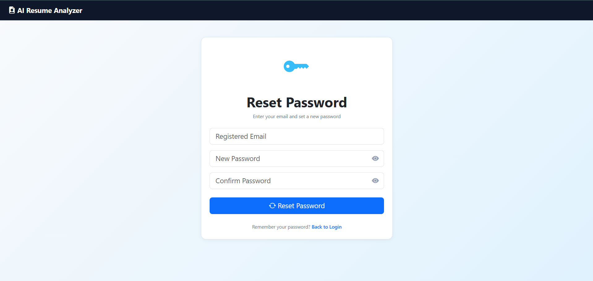

# AI Resume Analyzer with ATS, Career Prediction & Secure Authentication


An intelligent full-stack web application that leverages **Artificial Intelligence, Machine Learning, and Natural Language Processing (NLP)** to analyze resumes, calculate ATS compatibility scores, extract technical skills, match job descriptions, predict suitable career roles, generate personalized career insights, and provide secure user account management.

This project simulates modern **AI-powered recruitment automation systems** used by hiring platforms and HR technology companies.

---

## Live Demo

**Live Application**  
https://ai-resume-analyzer-sg14.onrender.com

---

## Project Overview

Recruiters often receive hundreds or thousands of resumes for a single role. Manual screening is time-consuming and inefficient.

**AI Resume Analyzer** automates candidate evaluation by intelligently analyzing uploaded resumes, extracting technical skills, calculating ATS compatibility, matching resumes with job descriptions, predicting suitable career roles, generating AI-powered career recommendations, and securely managing user accounts.

This project demonstrates practical implementation of **Artificial Intelligence in Recruitment Technology (HR Tech)**.

---

## Key Features

* Secure User Authentication System  
* User Registration and Login  
* Forgot Password Reset System  
* Permanent Account Deletion Feature  
* Resume PDF Upload and Parsing  
* NLP Based Skill Extraction  
* ATS Compatibility Score Calculation  
* Job Description Matching Engine  
* Machine Learning Career Role Prediction  
* AI Generated Career Feedback  
* Resume Analysis History Tracking  
* Dashboard Analytics with Visualization  
* PDF Report Generation  
* Cloud Deployment using Render  

---

## Why This Project?

Traditional recruitment systems require recruiters to manually review large numbers of resumes, making hiring slow and inefficient.

This project solves that problem by automating candidate evaluation through Artificial Intelligence.

The system helps:

* Automate resume screening  
* Improve ATS compatibility analysis  
* Match resumes against job descriptions  
* Predict suitable technical job roles  
* Provide intelligent resume improvement suggestions  
* Reduce recruiter screening effort  
* Deliver faster hiring workflows  

---

## System Workflow

```text
User Registration / Login
        ↓
Resume Upload
        ↓
PDF Text Extraction
        ↓
Resume Text Preprocessing
        ↓
NLP Skill Extraction
        ↓
ATS Score Calculation
        ↓
Job Description Matching
        ↓
Machine Learning Role Prediction
        ↓
AI Career Feedback Generation
        ↓
Generate PDF Report
        ↓
Store Resume History
        ↓
Dashboard Analytics
        ↓
Forgot Password / Delete Account Management
````

---

## Authentication Workflow

```text
Register Account
      ↓
Login
      ↓
Analyze Resume
      ↓
View Dashboard + History
      ↓
Forgot Password (Reset Password)
      ↓
Delete Account (Permanent Removal)
      ↓
Register Again Using Same Email
```

---

## Security Features

* Password Hashing using Werkzeug Security
* Session Based Authentication
* Secure Login Validation
* Forgot Password Reset Workflow
* Permanent Account Deletion System
* Protected User Specific Resume History
* User Data Isolation using Session Management

---

## Technology Stack

### Frontend

* HTML5
* CSS3
* Bootstrap
* JavaScript

### Backend

* Python
* Flask
* Jinja2 Templates
* Flask Blueprints

### Database

* SQLite

### Machine Learning

* Scikit-learn
* TF-IDF Vectorization
* LinearSVC Classifier

### Natural Language Processing

* Resume Parsing
* Skill Extraction
* Text Processing
* Keyword Matching

### Libraries Used

* Pandas
* NumPy
* Pickle
* PyPDF Libraries
* ReportLab
* Werkzeug Security

---

## Machine Learning Pipeline

The system uses supervised machine learning trained on resume datasets to predict suitable technical career roles.

### Pipeline Steps

* Resume Text Cleaning
* Data Preprocessing
* Feature Extraction using TF-IDF
* Resume Classification
* Career Role Prediction

### Supported Career Roles

* AI Engineer
* Backend Developer
* Cloud Engineer
* Cybersecurity Analyst
* Data Analyst
* Data Scientist
* DevOps Engineer
* Frontend Developer
* Full Stack Developer
* Machine Learning Engineer
* Mobile Developer
* QA Engineer

### Model Performance

* Algorithm Used: LinearSVC
* Feature Extraction: TF-IDF Vectorizer
* Classification Accuracy: 99%
* Cross Validation Accuracy: 99%

---

## Project Structure

```text
AI_Resume_Analyzer/

├── app.py
├── requirements.txt
├── .gitignore
│
├── dataset/
│   ├── resume_dataset_v3.csv
│   └── skills.csv
│
├── ml_models/
│   ├── train_model.py
│   ├── resume_classifier.pkl
│   └── vectorizer.pkl
│
├── models/
│   └── database.py
│
├── routes/
│   ├── auth_routes.py
│   ├── dashboard_routes.py
│   ├── history_routes.py
│   ├── main_routes.py
│   └── resume_routes.py
│
├── services/
│   ├── ats_engine.py
│   ├── chart_service.py
│   ├── jd_matcher.py
│   ├── report_service.py
│   ├── resume_service.py
│   └── skill_extractor.py
│
├── utils/
│   ├── ai_feedback.py
│   ├── pdf_reader.py
│   ├── role_predictor.py
│   └── skill_extractor.py
│
├── templates/
│   ├── login.html
│   ├── register.html
│   ├── forgot_password.html
│   ├── index.html
│   ├── result.html
│   ├── dashboard.html
│   └── history.html
│
├── static/
│   ├── css/
│   ├── uploads/
│   ├── reports/
│   └── screenshots/
│
└── resume.db
```

---

## Screenshots

### Login Page

Secure authentication system for registered users.


---

### Registration Page

Create a secure account before accessing resume analysis.


---

### Forgot Password Page

Users can securely reset their password.



---

### Home Page

Upload resume and optionally provide job description for intelligent analysis.


---

### Resume Analysis Result

Displays ATS score, predicted role, PDF report generation, and job description matching.


---

### ATS and Skills Analysis

Displays extracted technical skills and ATS compatibility evaluation.


---

### AI Career Feedback

Provides intelligent career improvement suggestions.


---

### Analytics Dashboard

Displays ATS trends, role distribution, and analytics insights.


---

### Analysis History

Stores previous resume analysis records and user activity.


---

## Installation

Clone repository

```bash
git clone https://github.com/bhanuprakash2508/ai-resume-analyzer.git
```

Move into project folder

```bash
cd ai-resume-analyzer
```

Install dependencies

```bash
pip install -r requirements.txt
```

Run application

```bash
python app.py
```

---

## Future Enhancements

* Semantic Resume Matching using NLP Embeddings
* Resume Ranking System for Recruiters
* Explainable AI Predictions
* Deep Learning based Resume Classification
* Recruiter Admin Dashboard
* Multi-language Resume Analysis
* Resume Recommendations using Generative AI

---

## Real World Applications

This project can be applied in:

* Recruitment Platforms
* HR Technology Solutions
* Applicant Tracking Systems (ATS)
* Automated Hiring Platforms
* Resume Optimization Platforms
* Career Guidance Applications

---

## Author

**CH BHANU PRAKASH**

GitHub: https://github.com/bhanuprakash2508

LinkedIn: https://linkedin.com/in/bhanuprakash-chintha

---

## License

Open source project developed for learning, research, and portfolio demonstration.

