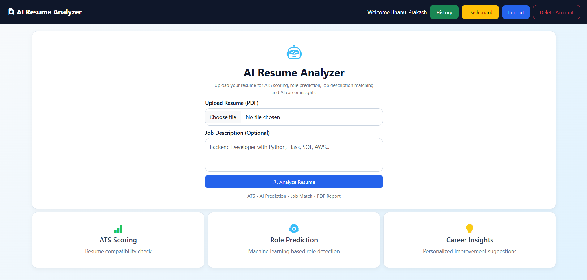
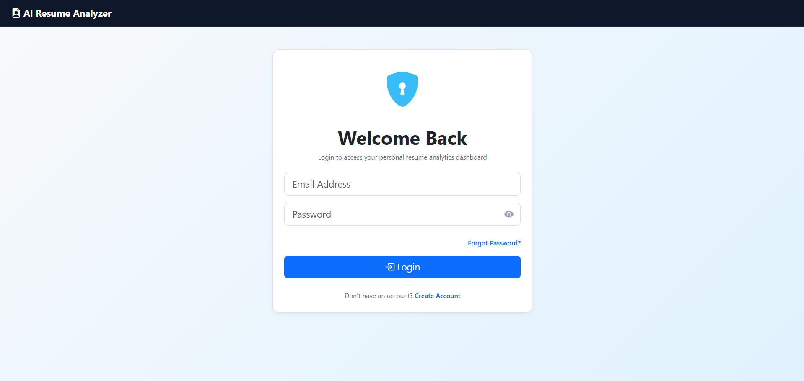
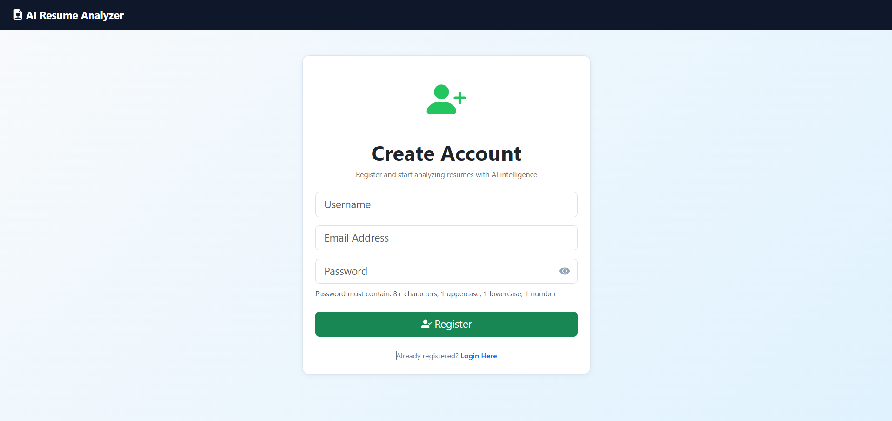
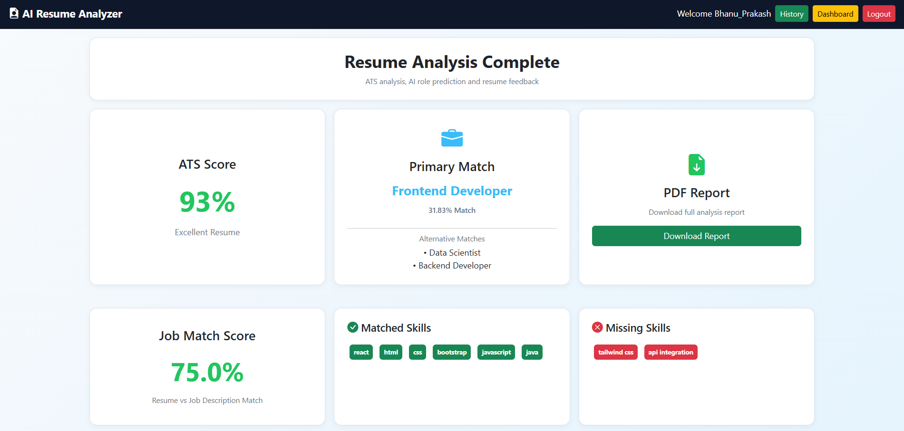
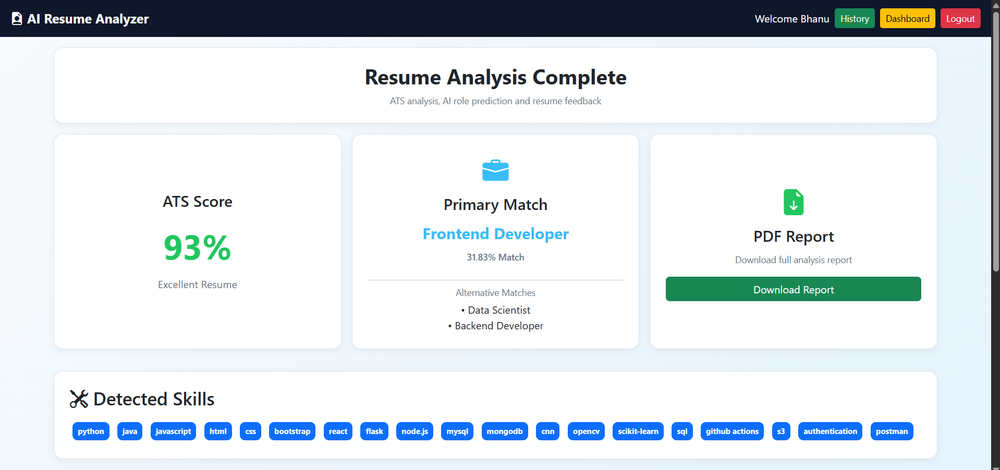
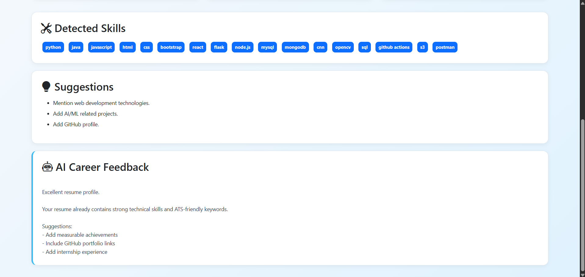
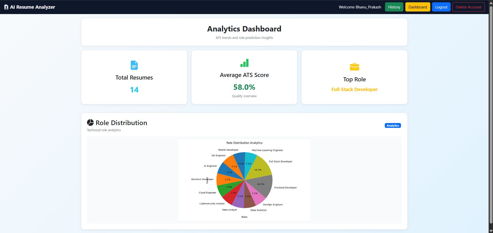
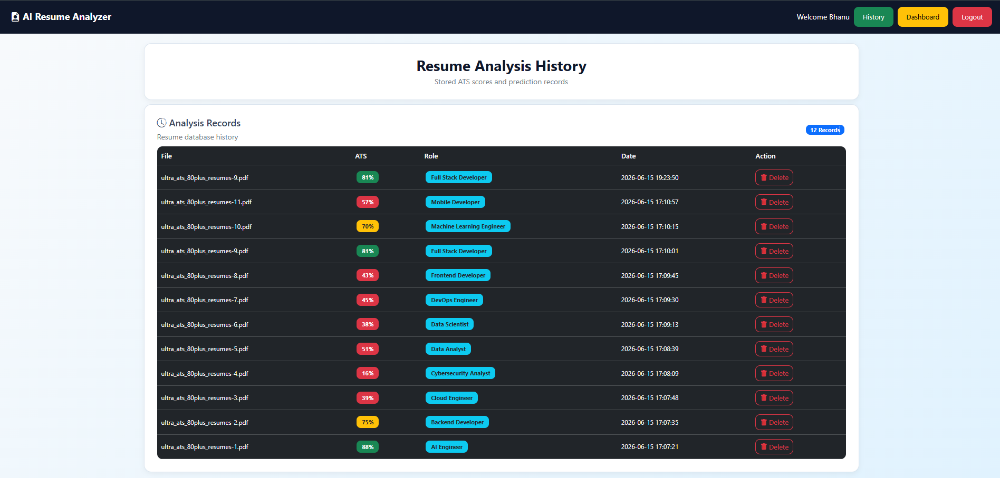

# AI Resume Analyzer with ATS & Career Prediction



An intelligent web application that leverages **Artificial Intelligence, Machine Learning, and Natural Language Processing (NLP)** to analyze resumes, calculate ATS compatibility scores, extract candidate skills, match job descriptions, predict suitable career roles, and provide personalized career insights.

This project simulates modern **AI-powered recruitment automation systems** used by hiring platforms and HR technology companies.

---

## Project Overview

Recruiters often receive hundreds or thousands of resumes for a single job opening. Manual resume screening is time-consuming and inefficient.

**AI Resume Analyzer** automates this process by intelligently analyzing uploaded resumes, extracting technical skills, calculating ATS compatibility, matching resumes with job descriptions, predicting suitable career roles, and generating AI-driven feedback for career improvement.

This project demonstrates a practical implementation of **Artificial Intelligence in Recruitment Technology (HR Tech)**.

---

## Key Features

* Secure User Authentication System
* Resume PDF Upload and Parsing
* NLP Based Skill Extraction
* ATS Compatibility Score Calculation
* Job Description Matching Engine
* Machine Learning Career Role Prediction
* AI Generated Career Feedback
* Resume Analysis History Tracking
* Dashboard Analytics with Visualization
* PDF Report Generation

---

## Why This Project?

Traditional recruitment systems require recruiters to manually review thousands of resumes, making hiring inefficient.

This project solves that problem by automating candidate evaluation through Artificial Intelligence.

The system helps:

* Automate resume screening
* Improve ATS compatibility analysis
* Match resumes against job descriptions
* Predict suitable technical job roles
* Provide intelligent resume improvement suggestions
* Reduce recruiter screening effort

---

## System Workflow

```text
Resume Upload
      ↓
PDF Text Extraction
      ↓
Resume Text Preprocessing
      ↓
NLP Skill Extraction
      ↓
ATS Score Calculation
      ↓
Job Description Matching
      ↓
Machine Learning Role Prediction
      ↓
AI Career Feedback Generation
      ↓
Store Analysis History
      ↓
Generate PDF Report
```

---

## Technology Stack

### Frontend

* HTML5
* CSS3
* Bootstrap
* JavaScript

### Backend

* Python
* Flask
* Jinja2 Templates
* Flask Blueprints

### Database

* SQLite

### Machine Learning

* Scikit-learn
* TF-IDF Vectorization
* LinearSVC Classifier

### Natural Language Processing

* Resume Parsing
* Skill Extraction
* Text Processing
* Keyword Matching

### Libraries Used

* Pandas
* NumPy
* Pickle
* PyPDF Processing Libraries

---

## Machine Learning Pipeline

The system uses a supervised machine learning pipeline trained on resume datasets to predict suitable technical job roles.

### Pipeline Steps

* Resume Text Cleaning
* Data Preprocessing
* Feature Extraction using TF-IDF
* Resume Classification
* Career Role Prediction

### Supported Career Roles

* AI Engineer
* Backend Developer
* Cloud Engineer
* Cybersecurity Analyst
* Data Analyst
* Data Scientist
* DevOps Engineer
* Frontend Developer
* Full Stack Developer
* Machine Learning Engineer
* Mobile Developer
* QA Engineer

### Model Performance

* Algorithm Used: LinearSVC
* Feature Extraction: TF-IDF Vectorizer
* Classification Accuracy: 99%
* Cross Validation Accuracy: 99%

---

## Project Structure

```text
AI_Resume_Analyzer/

├── app.py
├── config.py
├── requirements.txt
├── .gitignore
│
├── dataset/
│   ├── resume_dataset_v3.csv
│   └── skills.csv
│
├── ml_models/
│   ├── train_model.py
│   ├── resume_classifier.pkl
│   └── vectorizer.pkl
│
├── models/
│   ├── database.py
│   └── __init__.py
│
├── routes/
│   ├── auth_routes.py
│   ├── dashboard_routes.py
│   ├── history_routes.py
│   ├── main_routes.py
│   ├── resume_routes.py
│   └── __init__.py
│
├── services/
│   ├── ats_engine.py
│   ├── chart_service.py
│   ├── jd_matcher.py
│   ├── report_service.py
│   ├── resume_service.py
│   ├── skill_extractor.py
│   └── __init__.py
│
├── utils/
│   ├── ai_feedback.py
│   ├── ats_score.py
│   ├── pdf_reader.py
│   ├── role_predictor.py
│   └── skill_extractor.py
│
├── templates/
│   ├── login.html
│   ├── register.html
│   ├── index.html
│   ├── result.html
│   ├── dashboard.html
│   └── history.html
│
├── static/
│   ├── css/
│   ├── uploads/
│   ├── reports/
│   └── screenshots/
│
└── resume.db
```

---

## Screenshots

### Login Page

Secure authentication system for registered users.



---

### Registration Page

New users can create an account to access the platform.



---

### Home Page

Main interface where users upload resume PDF and optionally provide job description for intelligent analysis.


---

### Resume Analysis Result

Displays complete resume evaluation including ATS score, role prediction, PDF report generation, and job match score.



---

### ATS & Skills Analysis

Shows detected technical skills extracted from resume and ATS compatibility evaluation.



---

### AI Career Feedback

Provides AI generated recommendations and personalized resume improvement suggestions.



---

### Analytics Dashboard

Displays resume analytics, ATS trends, role distribution, and performance insights.



---

### Analysis History

Stores previous resume analysis records with ATS scores, predicted roles, and history management.



---

## Installation

Clone repository

```bash
git clone https://github.com/your-username/ai-resume-analyzer.git
```

Move into project folder

```bash
cd ai-resume-analyzer
```

Install dependencies

```bash
pip install -r requirements.txt
```

Run application

```bash
python app.py
```

---

## Future Enhancements

* Semantic Resume Matching using NLP Embeddings
* Resume Ranking System for Recruiters
* Explainable AI Predictions
* Deep Learning based Resume Classification
* Recruiter Admin Dashboard
* Cloud Deployment Support
* Multi-language Resume Analysis

---

## Real World Applications

This project can be applied in:

* Recruitment Platforms
* HR Technology Solutions
* Applicant Tracking Systems (ATS)
* Automated Hiring Platforms
* Resume Optimization Platforms
* Career Guidance Applications

---

## Author

**CH BHANU PRAKASH**

GitHub: https://github.com/bhanuprakash2508

LinkedIn: https://linkedin.com/in/bhanuprakash-chintha

---

## License

Open source project developed for learning, research, and portfolio demonstration.
